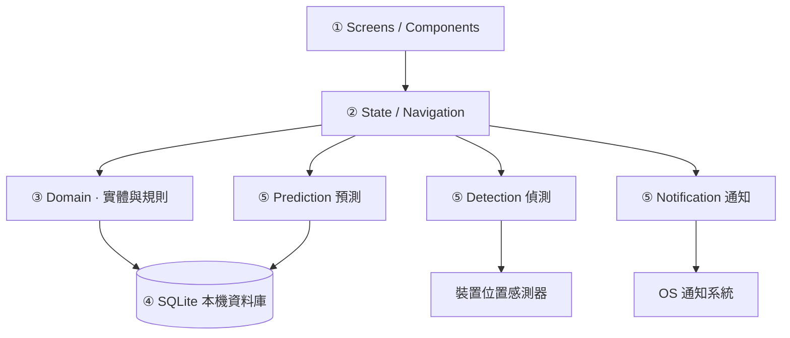

# 🏗️ Architecture · 技術架構

> 目標：離線優先、隱私優先（偵測與預測盡量在裝置端）、i18n 從第一天內建、AI 能力以可抽換服務模組呈現（規則式先行，模型後接）。

---

## 🧰 Tech Stack · 技術棧（已定案）

> **2026-08-18 拍板：Expo（React Native）＋ TypeScript**，以 dev client（prebuild）起案（背景定位偵測需要）。下表為評估紀錄。

| 方案 | 優點 | 代價 | 決定 |
|---|---|---|---|
| **Expo（React Native）＋ TypeScript** | 單一 codebase 出 iOS/Android；i18next 生態成熟；設計 token 直接對應原型 CSS；OTA 更新；Claude Code 對 React/TS 支援最佳 | 效能略遜原生 | ✅ **已採用** |
| Flutter ＋ Dart | UI 一致性高、效能好 | 需 Dart、圓角字體等細節客製成本 | 未採用 |
| Swift ＋ Kotlin 雙原生 | 最佳原生體驗 | 兩套 codebase、雙語維護成本 ×2 | 不建議 |
| PWA | 上線最快 | 背景位置偵測、推播、感測器皆受限 | 不建議（FR-DTC 需原生能力） |

配套選型（定案）：

| 範疇 | 選擇 |
|---|---|
| 狀態 | Zustand（輕量、無樣板） |
| 資料庫 | expo-sqlite ＋ 自寫 repository（離線優先，無後端） |
| 導覽 | expo-router（4 分頁 + Sheet/Toast 為 overlay） |
| 通知 | expo-notifications（溫和卡片＝App 內、主動推播＝系統通知） |
| 位置 | expo-location（geofence／停留偵測） |
| i18n | i18next ＋ react-i18next ＋ Intl（詳見 [I18N.md](./I18N.md)） |
| 測試 | Jest ＋ React Native Testing Library（邏輯）／ Detox（E2E，Phase 5） |

工具鏈與版本原則：Expo SDK 最新穩定版、TypeScript（strict 模式）、Node LTS、EAS Build 打包（dev client）、ESLint ＋ Prettier、i18next lint 規則（NFR-6 強制）。

---

## 🧱 Layers · 分層架構

```
① 呈現層 Presentation   screens/ components/     只管畫面與輸入，不含業務規則
② 應用層 Application    state/ navigation/       畫面狀態、導覽、操作流程編排
③ 領域層 Domain         domain/                  實體（Event/Routine/…）與純邏輯規則（統計、streak、提醒策略）
④ 資料層 Data           data/                    SQLite repository、migration、匯出
⑤ 智慧服務 AI Services  services/                prediction / detection / notification 三個可抽換模組
```

依賴方向單向：①→②→③→④；②可呼叫⑤，⑤讀④、不碰①②。統計與預測演算法放在③⑤的**純函式**中，滿足 NFR-5 可測性。



---

## 🗃️ Data Model · 資料模型

```ts
// 類別（固定 7 類，label/color 走 i18n 與 token，不入庫）
type CategoryKey = 'work' | 'sleep' | 'meal' | 'exercise' | 'leisure' | 'commute' | 'other';

// 時段事件：24h 制，start/end 為 0–24 的小數（步階 0.25＝15 分鐘），可跨日（start > end 代表跨午夜）
interface Event {
  id: string;
  date: string;            // YYYY-MM-DD（所屬日）
  start: number;           // 0–24
  end: number;
  category: CategoryKey;
  label: string;
  predicted: boolean;      // true＝AI 預測待確認；確認後改 false
  source: 'manual' | 'detected' | 'predicted';
  createdAt: number; updatedAt: number;
}

interface Routine {
  id: string; label: string;
  timeHint: string;        // 建議時段（如 "07:15"），供預測與提示
  streak: number;          // 連續完成天數
  doneDate: string | null; // 今日是否已完成（跨日重算的依據）
}

interface ScheduleItem {
  id: string; title: string;
  timeLabel: string; recurrenceLabel: string;   // 原型口徑（顯示用）；實作改存結構化欄位
  reminderOn: boolean;
}

interface Settings {
  language: 'zh-TW' | 'en-US';   // 預設 zh-TW（FR-I18N）
  sleepStart: number; sleepEnd: number;  // 0–24，步階 0.25，環繞
  flexEnabled: boolean; irregularMode: boolean;
  sensitivity: 0 | 1 | 2;        // 低/中/高
  leadTime: number;              // 5–30 分鐘，步階 5
  notifyStyle: 'gentle' | 'push';
  quietHoursOn: boolean;         // 22:00–07:00
  onboardingDone: boolean;
}
```

不變量（invariants，寫成領域層純函式並測試）：

- 事件不可重疊（同 category 連續段可合併）；`end - start ∈ [0.25, 24]`
- `leadTime` 夾限 5–30；睡眠時間 ±0.25 環繞 0/24
- 確認預測事件＝`predicted: false` 且不可逆轉回預測（要改就重編輯）
- streak 規則：當日完成 → +1；當日取消 → −1；跨日未完成 → 歸零重算（依 doneDate 與歷史紀錄）

---

## 🤖 AI Services · 智慧服務模組

### Prediction 預測（v1 規則式 → v2 裝置端模型）

| 版本 | 作法 | 對應需求 |
|---|---|---|
| v1（Phase 4） | 規則式：例行工事 timeHint ＋ 歷史同時段類別眾數 ＋ 睡眠視窗，產出候選事件與信心分數 | 敏感度＝信心門檻：低 ≥0.8／中 ≥0.6／高 ≥0.4；彈性作息＝輸出時間區間而非單點；非規律模式＝降低「規律假設」權重 |
| v2（上線後評估） | 裝置端模型（Core ML / TensorFlow Lite），訓練與推論皆不出裝置 | NFR-1 |

誠實失敗原則：信心不足即不預測，不得為了畫面完整而虛構事件。

### Detection 情境偵測

- geofence（常用地點學習）＋ 停留判定（同一地點 ≥ N 分鐘，原型範例 45 分鐘）
- 觸發 Toast（App 內）；`notifyStyle = push` 時才另發系統通知；`quietHoursOn` 且落在 22:00–07:00 → 僅保留待確認卡片，不推播
- 原始軌跡只在記憶體/裝置端使用，不落雲端（NFR-1）

### Notification 提醒

- 排程提醒：事件開始前 `leadTime` 分鐘
- 通知風格：`gentle`＝App 內建議卡片（開 App 才見）；`push`＝系統推播
- 免打擾時段優先於一切主動推播

---

## 🔔 Push & Background · 推播與背景執行

- 偵測與提醒需背景執行：iOS 背景定位（significantly-change/geofence）、Android foreground service 或 WorkManager——Expo 需 dev client（prebuild），純 managed workflow 不可用，Phase 1 即以 **dev client** 起案
- 洞察文字（FR-STA 卡片 4）：v1 以範本＋統計數值於本機組字（雙語範本見 I18N.md），不上傳資料

---

## 🌐 i18n 架構

- i18next 單例：`src/i18n/`，locale 檔 `zh-TW.json`／`en-US.json` 對稱維護
- 語言來源：`Settings.language`（App 內切換）＞系統語言＞預設 zh-TW
- 日期/時長/streak 一律 `Intl` 格式化，禁止字串串接
- 詳細 key 對照與規則見 [I18N.md](./I18N.md)

---

## 🧪 Testing · 測試策略

| 層 | 工具 | 重點 |
|---|---|---|
| 領域純函式 | Jest | 重疊判定、streak 重算、統計口徑（本週/本月）、信心門檻 |
| 元件 | React Native Testing Library | 三種日檢視渲染、Sheet/Toast 互動、雙語渲染 |
| 服務 | Jest ＋ 感測器模擬 | 停留判定、免打擾抑制、leadTime 邊界 |
| E2E（Phase 5） | Detox | 核心流程：onboarding → 記錄 → 確認預測 → 統計 |
